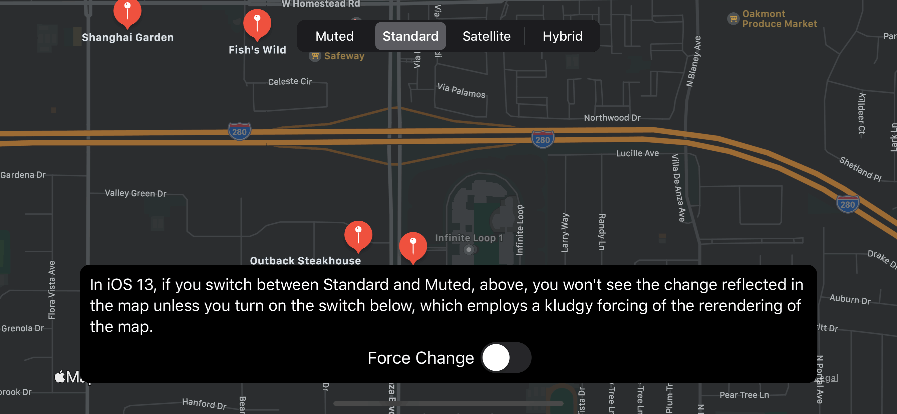
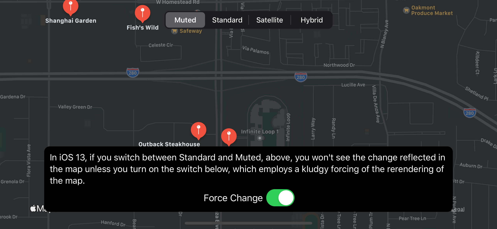

#  MKMapView Muted-to-Standard Map Type Bug

This is a demonstration of a problem that manifests itself in iOS 13 where changes to a map view type as you go from `.standard` to `.mutedStandard` is not reflected in the UI. If you move the map a little (including using `userTrackingMode` of `.follow` or manually dragging), the change is suddenly reflected. But if you're not moving the map, the change is not reflected. 

You can also force the map view to be re-rendered by either:

* Reset the  `centerCoordinate` of the map view.
* Instead of going directly from `.standard` to `.mutedStandard` (or vice versa), change to `.satellite`  first, and it works.

Obviously, both of those are fairly kludgy workarounds for this iOS 13 issue, but they work.

The bug does not manifest itself in the following scenrios:

* Works as expected in iOS 12; only an issue in iOS 13.
* Works as expected when going from `.standard`/`.mutedStandard` to `.satellite`/`.hybrid` or vice versa; only an issue when going between `.standard` and `.mutedStandard`.

The salient code is found in the [`ViewController`](MutedToStandardBug/ViewController.swift#L36).

I’m running Xcode 11.4 (11E146) on Catalina 10.15.4 (19E266) on MacBook Pro (15-inch, 2018). The behavior manifests in both devices and simulators, but in iOS 13 only. 

---

April 3, 2020

Copyright (c) 2020 Rob Ryan. All Rights Reserved.

See [License](LICENSE.md).
